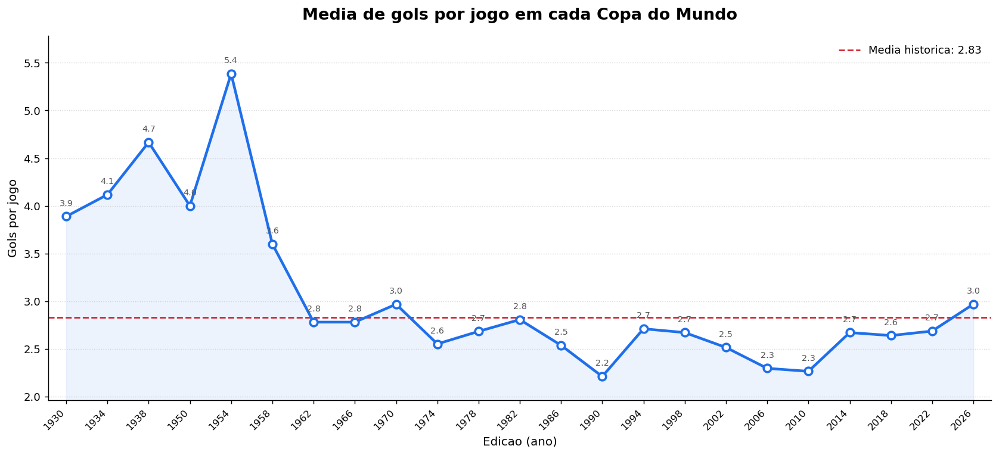
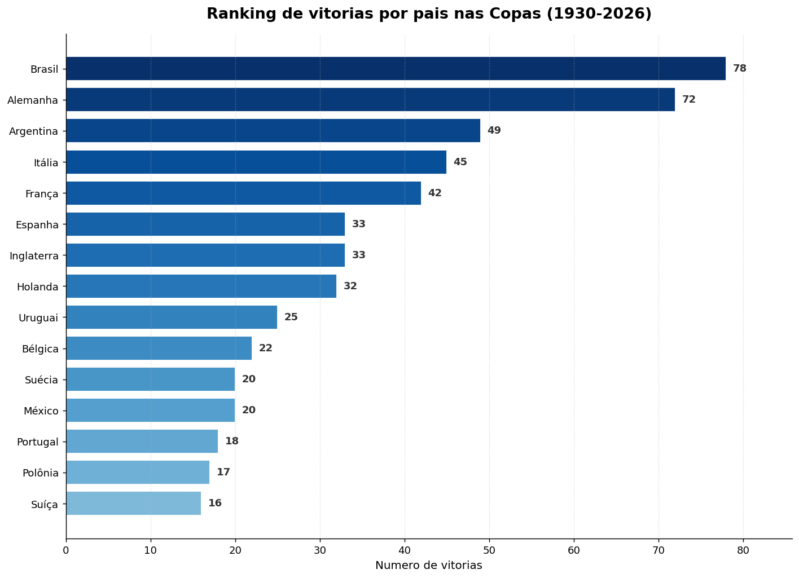
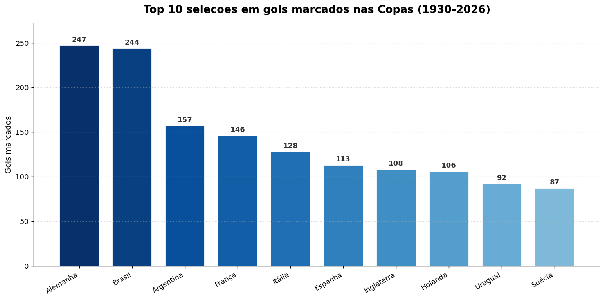
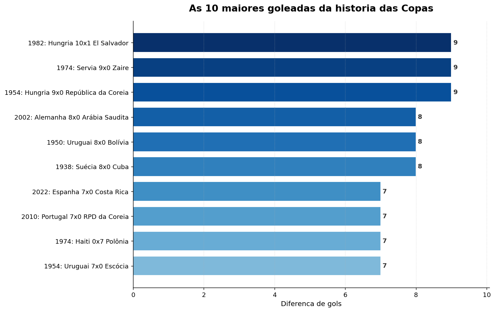

# ⚽ Análise de Dados da Copa do Mundo (API da FIFA)

Projeto em Python que extrai dados de jogos da API pública da FIFA
(`api.fifa.com/api/v3`) e faz análises estatísticas, previsões e gráficos
sobre a Copa do Mundo — de 1930 até a edição de 2026.

> ⚠️ A API da FIFA não é oficialmente documentada para terceiros. Ela abastece
> o site da FIFA e pode mudar de estrutura ou bloquear o acesso sem aviso.
> Para um projeto de estudo é ótima; para algo de produção, considere um
> provedor de dados de futebol com contrato.

---

## 📂 Scripts

| Script | O que faz |
|--------|-----------|
| `fifa_extrair_jogos.py` | Baixa os jogos (todas as edições) e gera `fifa_jogos_completo.json` (dado bruto) e `fifa_jogos.csv` (dado tratado, com data legível, vencedor e seleções unificadas). |
| `fifa_jogos_de_hoje.py` | Mostra os jogos do dia com palpite, placar previsto e — para os já encerrados — o resultado real. |
| `fifa_simular_campeao_2026.py` | Estima a chance de cada seleção ser campeã de 2026 simulando o torneio milhares de vezes (Monte Carlo). |
| `fifa_analise_gols.py` | Gera gráficos sobre gols e goleadas em todas as Copas. |

---

## 🚀 Como usar

1. Instale as dependências:
   ```bash
   pip install requests matplotlib pandas
   ```

2. Baixe os jogos (no topo do `fifa_extrair_jogos.py`, deixe `TODAS_AS_EDICOES = True`):
   ```bash
   python fifa_extrair_jogos.py
   ```
   Isso cria `fifa_jogos_completo.json` e `fifa_jogos.csv`.

3. Rode as demais análises conforme a necessidade:
   ```bash
   python fifa_jogos_de_hoje.py
   python fifa_simular_campeao_2026.py
   python fifa_analise_gols.py
   ```

---

## 📊 Análises

> Para as imagens aparecerem, salve cada gráfico na pasta `imagens/` com o nome
> indicado (use `plt.savefig("imagens/NOME.png", dpi=130, bbox_inches="tight")`
> no lugar do `plt.show()` na célula correspondente do Jupyter).

### Média de gols por Copa


### Top 10 países em vitórias


### Top 10 seleções em gols marcados


### As 10 maiores goleadas da história


---

## ⚙️ Detalhes técnicos

- **Fonte dos dados:** API pública da FIFA (`api.fifa.com/api/v3`), sem chave nem login.
- **Competição:** Copa do Mundo masculina (`idCompetition = 17`); edição de 2026 = `idSeason 285023`.
- **Fuso horário:** os horários são convertidos de UTC para Brasília (UTC−3); ajustável em `FUSO_HORARIO`.
- **Padronização de seleções:** Alemanha Ocidental é unificada com a Alemanha (a Oriental fica separada); União Soviética → Rússia; Iugoslávia → Sérvia.
- **Previsão:** força de ataque/defesa medida pelos jogos já disputados + distribuição de Poisson + simulação de Monte Carlo. É uma estimativa estatística, **não** um resultado garantido.

---

## 📝 Observações

- O `fifa_jogos_completo.json` guarda os dados **brutos** (fiéis à fonte); o
  `fifa_jogos.csv` guarda os dados **tratados** (limpos para análise).
- As previsões dependem dos jogos já disputados: no início do torneio são
  grosseiras e ficam mais precisas conforme mais partidas acontecem.

---

*Projeto de estudo. Os dados pertencem à FIFA.*
